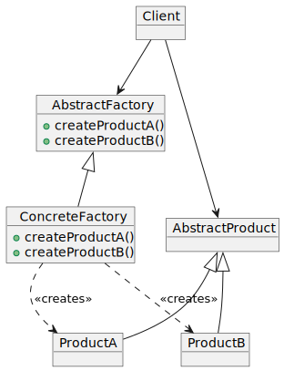

# Abstract factory pattern

The intent of the Abstract Factory design pattern is to provide an interface for creating families of related or dependent objects without specifying their concrete classes.

The Abstract Factory design pattern solves problems like:
– How can a class be independent of how the objects it requires are created?
– How can different families of related or dependent objects be created?

